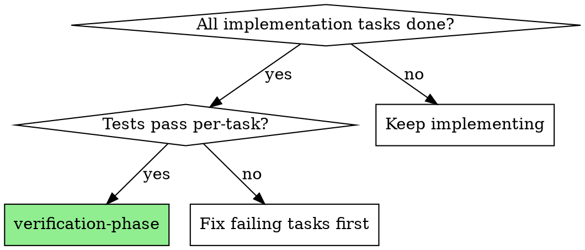
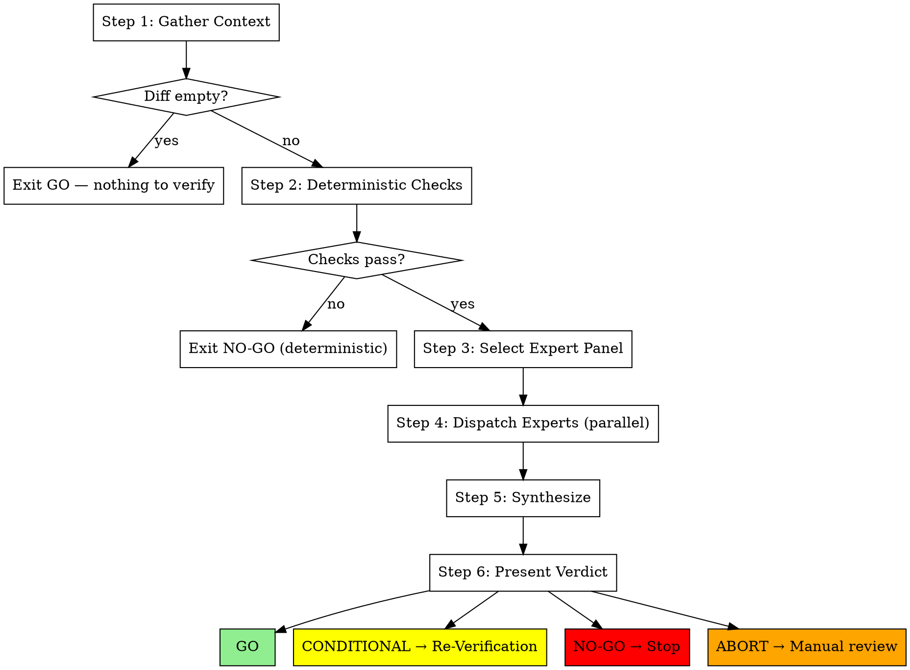

# Verification Phase

Orchestrate a panel of expert reviewers — 3 fixed baseline experts plus 1-3 dynamically selected subject matter experts — to verify a complete feature before merge. Experts run in parallel with fresh context, then a synthesis pass deduplicates findings and produces a go/no-go verdict.

**Announce at start:** "I'm using the verification-phase skill to verify this feature before merge."

## When to Use



Use after all implementation tasks complete, before finishing a development branch. Also invocable standalone for ad-hoc verification of any non-trivial change.

## The Process



### Step 1: Gather Context

1. Read spec file (from plan header `**Spec:**` field, user-provided path, or prompt user if neither available)
2. Read plan file (co-located with spec)
3. Get full git diff:
   ```bash
   git diff --submodule=diff $(git merge-base HEAD main)..HEAD
   ```
   The `--submodule=diff` flag ensures changes inside submodules appear in the diff rather than just showing pointer changes.
4. **If diff is empty → report "Nothing to verify" and exit GO.** Do not proceed.
5. List changed files and their directories

### Step 2: Deterministic Checks (Fail-Fast)

Run the project's standard quality checks. Use this detection priority — stop at the first match:

| Priority | Detected by | Commands |
|----------|-------------|----------|
| 1 | `Makefile` exists | `grep -q '^lint:' Makefile && make lint; grep -q '^typecheck:' Makefile && make typecheck; grep -q '^test:' Makefile && make test` |
| 2 | `pyproject.toml` exists | `uv run ruff check . && uv run mypy src/ && uv run pytest tests/ -x` |
| 3 | `package.json` exists | `npm run lint && npm test` |
| 4 | `.tf` files exist | `terraform fmt -check && terraform validate && tflint` |
| 5 | `.pre-commit-config.yaml` exists | `pre-commit run --all-files` |
| 6 | None of the above | Skip with warning: "No quality checks detected. Proceeding to expert panel." |

**Monorepo scoping:** For monorepo structures with multiple sub-projects, scope checks to changed files only. Identify which sub-projects have changes from the changed file list and run checks only for affected sub-projects. Example: ADT repo with `prototype/` and `adt-validation-dashboard/` — if only dashboard files changed, run `make test-dashboard`, not `make test`.

**If ANY check fails → STOP.** Report failures with verdict **NO-GO** (tagged `deterministic`). Do not proceed to expert panel.

### Step 3: Select Expert Panel

1. **Baseline experts (always included):**
   - `integration-regression` — cross-module impact, does the whole feature work together
   - `test-coverage` — holistic coverage gaps, missing edge cases, untested error paths
   - `spec-drift` — re-reads spec against final implementation, checks nothing was lost or added
   - Skip `spec-drift` if no spec is available

2. **Dynamic SME selection:** Match changed files against trigger rules in each expert's frontmatter (`extensions`, `directories`, `keywords`). An expert is selected if any trigger matches.

3. **Cap at 3 dynamic experts.** When more than 3 trigger, rank by number of matching files and select top 3.

4. **Present panel and wait for user override:**
   ```
   Verification panel:
     Baseline: integration-regression, test-coverage, spec-drift
     Dynamic:  terraform, python (auto-selected from .tf and .py changes)

   Override? (enter to accept, or list replacements)
   ```
   Wait for user response. Enter accepts; user can add/remove experts.

### Step 4: Dispatch Experts (Parallel)

For each selected expert:
1. Read the expert's prompt template from `experts/<name>.md`
2. Fill placeholders: `{SPEC_CONTENT}`, `{PLAN_CONTENT}`, `{DIFF}`, `{CHANGED_FILES}`
3. Dispatch as parallel subagent

**Guardrails:**

| Guardrail | Value | Behavior |
|-----------|-------|----------|
| Max diff size | 3000 lines | Truncate with summary header noting total lines and which files were truncated. Experts receive summary + most-changed files in full. |
| Per-expert timeout | 90 seconds | Skip timed-out expert, note in synthesis manifest. |
| Malformed output | — | Synthesis treats it as a single "minor" finding with raw text as detail. |

**Partial panel policy:**
- **Dynamic expert** fails/times out → synthesis proceeds without it (noted in manifest)
- **Baseline expert** fails/times out → synthesis proceeds but flags the gap as a **warning** — baseline gaps reduce confidence in the overall verdict

Each expert returns a structured report:

```markdown
### Findings
- **Severity:** critical | important | minor
- **Confidence:** 0-100
- **File:** path/to/file.py:L42
- **Issue:** <one-line description>
- **Detail:** <explanation + evidence from diff>
- **Suggestion:** <how to fix>

### Verdict
GO | NO-GO | CONDITIONAL
<1-2 sentence justification>
```

### Step 5: Synthesize

Dispatch synthesis agent (`synthesis.md`) with ALL expert reports **and a manifest** listing:
- Which experts were dispatched
- Which completed successfully
- Which failed/timed out
- Which were skipped (e.g., spec-drift when no spec)

The synthesis agent:

1. **Deduplicates** — same issue flagged by multiple experts gets merged (note which experts agreed)
2. **Resolves contradictions** — if expert A says safe and expert B says risky, synthesis explains both positions
3. **Filters by confidence** — severity-weighted thresholds:

   | Severity | Minimum confidence |
   |----------|--------------------|
   | Critical | ≥ 60 |
   | Important | ≥ 75 |
   | Minor | ≥ 85 |

   Findings below their threshold are moved to a "Below-threshold notable findings" appendix (not silently discarded).

4. **Produces unified report:**

```markdown
## Verification Report

### Critical Issues (must fix before merge)
<issues>

### Important Issues (should fix)
<issues>

### Minor Observations (note for later)
<issues>

### Below-Threshold Notable Findings
<issues that didn't meet confidence threshold, for reference>

### Expert Agreement
<which experts agreed/disagreed on key findings>

### Overall Verdict: GO | NO-GO | CONDITIONAL
<justification referencing expert consensus>
```

### Step 6: Present Verdict

| Verdict | Action |
|---------|--------|
| **GO** | Return success. Caller proceeds (finishing-a-development-branch Step 2). |
| **CONDITIONAL** | List what must be fixed. Offer to fix now. Follow Re-Verification Protocol. |
| **NO-GO** | List blockers. Stop workflow. Escalate to user. |
| **ABORT** | Operational failure (expert timeout, context overflow). Report what happened, suggest manual review. |

## Re-Verification Protocol

When verdict is CONDITIONAL:

1. **Fix mechanism:** Dispatch implementer subagent with the specific issues to fix (consistent with subagent-driven-development pattern). User can also fix manually.
2. **Re-run scope:** Restart from **Step 1** (deterministic checks — fixes may break things). Use the **same expert panel** as the original run. No re-selection — prevents new triggers creating infinite loops.
3. **Delta analysis:** Synthesis agent receives the previous run's report alongside new expert reports, enabling it to confirm fixes and detect regressions.
4. **Max iterations:** 3 re-runs. If CONDITIONAL persists after 3 cycles, escalate to user with full history of all runs.
5. **Escalation:** Present all 3 synthesis reports and ask user to decide: force GO, continue fixing, or abandon.

## Graceful Degradation

Not all work has a spec (bug fixes, small changes). When invoked without a spec/plan:

- **spec-drift** expert is skipped (nothing to drift from)
- **integration-regression** and **test-coverage** still run (they work from the diff)
- Dynamic SMEs still selected from file changes
- Synthesis still produces a verdict
- The skill remains useful for any non-trivial change, not just spec-driven work

## Integration

| Relationship | Skill |
|-------------|-------|
| **Called by** | `finishing-a-development-branch` (Step 1 — replaces simple test run) |
| **Called transitively by** | `subagent-driven-development`, `executing-plans` (both call finishing-branch) |
| **Complementary** | `verification-before-completion` (individual claim gate), `code-review` (PR-level, reviewer-facing) |

## Anti-Rationalization Table

Before skipping or shortcutting verification, check your excuse against reality:

| Rationalization | Reality |
|---|---|
| "Tests pass, we're good" | Tests verify expected behavior. Experts catch unexpected behavior, integration issues, and spec drift. |
| "Per-task reviews already caught everything" | Per-task reviews see one task at a time. Cross-cutting concerns only emerge when you look at the whole feature. |
| "This is a small change, skip verification" | Small changes cause production outages. The 8192 token limit bug was a 'small change'. |
| "The expert panel is too expensive" | Finding a bug in review costs tokens. Finding it in production costs trust. |
| "I'll just run the baseline, skip dynamic experts" | Dynamic experts exist because domain-specific issues are invisible to generalists. |

## Red Flags

**Never:**
- Skip deterministic checks (Step 2) — they are the fail-fast gate
- Proceed with a NO-GO verdict — stop and escalate
- Ignore baseline expert failures — baseline gaps reduce confidence and must be flagged
- Silently discard below-threshold findings — move them to the appendix
- Re-select the expert panel during re-verification — use the same panel to prevent infinite loops
- Exceed 3 re-verification iterations without escalating to the user
- Dispatch experts without filling all placeholders in the prompt template
- Skip the user override prompt in Step 3 — always present the panel and wait

**Always:**
- Run deterministic checks before dispatching experts
- Present the expert panel for user approval
- Include the manifest in synthesis dispatch
- Apply severity-weighted confidence thresholds (critical ≥ 60, important ≥ 75, minor ≥ 85)
- Flag baseline expert gaps as warnings in the synthesis report
- Restart from Step 1 on re-verification (fixes may break deterministic checks)
